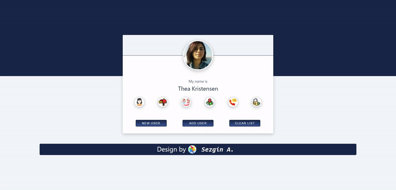

# Random User App v2

## Table of contents

- [Overview](#overview)
  - [Description](#description)
  - [Project Skeleton](#project-skeleton)
  - [Screenshot](#screenshot)
  - [Links](#links)
- [My process](#my-process)
  - [Built with](#built-with)


## Overview

### Description

The project creates an information card by retrieving user information from the random user appv2

### Project Skeleton

```
random-user-appv2 (folder)
       public(folder)
           |----index.html 
       src (folder)
           |----app.js 
           |----index.js
           |----index.css 
           components (folder)
                 footer (folder) 
                        |----Footer.css
                        |----Footer.js
                |----Table.jsx
                |----Main.jsx
           assets (folder)
                |----(image files)
               
```

### Screenshot

<p align="center">
<a href="https://sezginakgul.github.io/random-user-appV2/"></a>
</p>


### Links

- Live: [Live Website](https://sezginakgul.github.io/random-user-appV2/)


### Built with

- REACT.JS
- JAVASCRİPT
- HTML5
- CSS3

